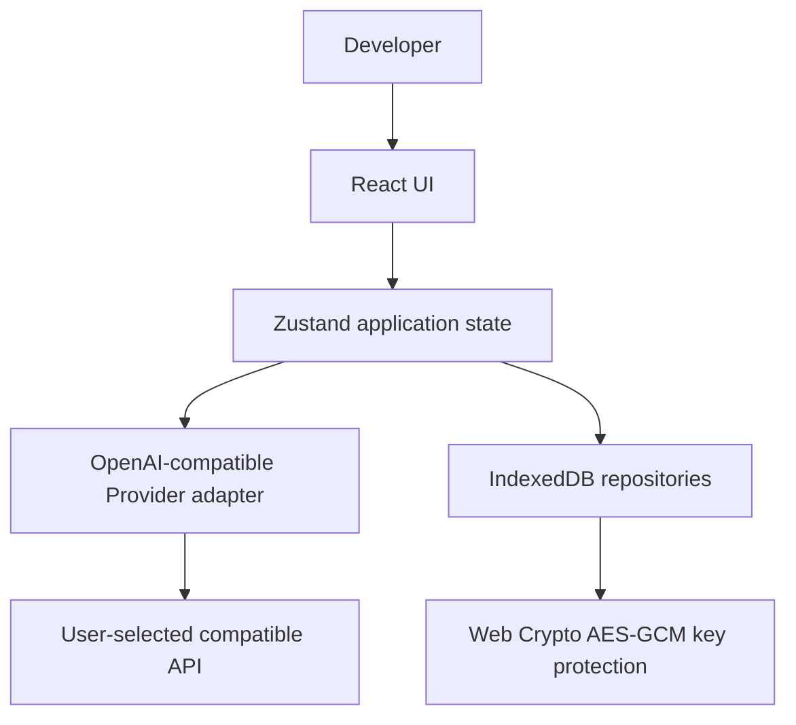

# OpenAPI Playground

> **A local-first workbench for testing OpenAI-compatible chat APIs, comparing models, and diagnosing failures.**

 

<p align="center">
  
</p>

OpenAPI Playground is an open-source developer tool for working with OpenAI-compatible chat-completion APIs directly from the browser. Configure a Provider, compose and inspect requests, compare up to three locally configured models, and turn failures into safe local diagnostics—without a shared proxy, cloud workspace, or account.

> The GIF and screenshots below use an isolated mock Provider with named demo data. They contain no real API keys, private prompts, or benchmark claims.

## Why OpenAPI Playground?

API experimentation often mixes credentials, requests, ad-hoc scripts, and provider-specific debugging. This project keeps the workflow in one local workbench while preserving explicit boundaries around Provider access and local data.

| Need                            | What the workbench provides                                                                                                                                |
| ------------------------------- | ---------------------------------------------------------------------------------------------------------------------------------------------------------- |
| Exercise a compatible API       | Multi-message chat-completion requests, streaming, abort, retry, request preview, response inspection, and portable code generation.                       |
| Compare models without rankings | Parallel runs across two or three configured targets, individual retry/stop controls, TTFT/latency/token readouts, text diff, and saved local comparisons. |
| Debug failures safely           | Normalized HTTP, authentication, rate-limit, network, CORS, model, context, and streaming diagnostics with local history and sanitized exports.            |
| Keep control of credentials     | Browser-local encrypted key material, IndexedDB-backed workspace records, and no shared API-key proxy.                                                     |

## Features

### Playground

- Send OpenAI-compatible `POST /chat/completions` requests with multi-role messages.
- Stream compatible SSE responses, stop an in-flight request, retry completed/failed/aborted work, and inspect request/response state.
- Review response content, metrics, JSON, safe headers, normalized errors, and generated cURL, Python, JavaScript, or Node.js snippets.
- Save reusable local prompts and keep a local request history.

### Model Compare

- Run one shared prompt across **two or three** locally configured targets in parallel.
- Keep streaming, stop, retry, failure state, TTFT, latency, token usage, and response inspection independent per target.
- Compare response text side-by-side or with a diff view; save, reopen, duplicate, rerun, or delete local comparisons.
- Show cost as `N/A` when no verified pricing information is available.

### Developer Diagnostics

- Normalize HTTP, authentication, rate-limit, network, CORS, invalid-model, context-length, streaming, and malformed-response failures.
- Keep local diagnostic history with filters, provider health checks, source-workflow navigation, and structured troubleshooting guidance.
- Export sanitized JSON, text, or Markdown reports without keys, authorization values, cookies, or secret headers.

### Local-first by design

- Store workspace data in browser IndexedDB and local storage.
- Encrypt persisted credential material with browser Web Crypto (AES-GCM); decrypt it locally only while sending to the selected Provider.
- Keep keys out of request history, saved comparisons, diagnostics, workspace exports, generated screenshots, and user-facing code examples.
- Make browser-direct Provider access explicit. Compatibility and CORS behavior vary by Provider endpoint; the app diagnoses failures rather than silently routing keys through a shared server.

## Quick start

### Prerequisites

- **Node.js 22**
- **pnpm 10**

### Install and run

```bash
pnpm install
pnpm dev
```

Open the URL printed by Vite, then begin at **Providers**.

### Verify locally

```bash
pnpm check
pnpm lint
pnpm test
pnpm exec playwright install chromium
pnpm test:e2e
pnpm build
```

## Provider setup

1. Open **Providers** and select **Add provider**.
2. Choose a preset or select a custom compatible Provider, then set its Base URL.
3. Enter a user-owned API key. It is stored locally and the previous value is never revealed by the edit flow.
4. Select **Test connection** to call `GET /models`; choose a discovered model or enter an exact model ID when discovery is unavailable.
5. Save the local Provider, then open **Playground** to compose and send a request.

The app is designed for OpenAI-compatible endpoints that provide authentication, model identifiers, and compatible `GET /models` and `POST /chat/completions` behavior. The Provider dialog includes presets for OpenAI, DeepSeek, Qwen, OpenRouter, and a custom compatible endpoint. Endpoint behavior, CORS support, streaming details, and model availability may vary by Provider; verify the connection and model against your own account and endpoint.

## Screenshots

All captures use the same dark theme and safe mock data. They show product state, not external performance benchmarks.

### Dashboard


### Playground


### Model Compare


### Developer Diagnostics


### Providers


## Security & privacy

OpenAPI Playground is Local-first, not a security guarantee. It is designed so that credentials are stored in the browser and used only for direct calls to the selected Provider. The application intentionally excludes secret values from history, saved comparisons, diagnostics, workspace exports, generated code examples, user-facing DOM views, and supported diagnostic/reporting paths.

Browser storage cannot protect against a compromised device, a malicious browser extension, or malicious code already running in the page. Use least-privilege, rotatable keys and never put real credentials, Authorization headers, private prompts, private responses, cookies, or diagnostic exports in screenshots, issues, commits, or logs. See [SECURITY.md](SECURITY.md) for private vulnerability reporting guidance and [docs/privacy.md](docs/privacy.md) for the storage boundary.

## Architecture



The client is a browser-first React application. Domain types and Provider behavior are separated from repository and storage concerns; short-lived credential access lives in the service layer. There is no cloud backend, shared API proxy, account database, or authentication server in the product architecture.

## Project structure

```text
client/
  src/
    components/       # Workbench primitives, provider dialog, shell, UI components
    contexts/         # Theme context
    domain/           # Types, Provider adapter, errors, compare, diagnostics, codegen
    hooks/            # Reusable client hooks
    pages/            # Dashboard, Playground, Compare, Providers, History, Diagnostics
    services/         # Provider, compare, and diagnostics orchestration
    storage/          # IndexedDB repositories and Web Crypto secret protection
    store/            # Zustand application state and workspace hydration
docs/                 # Architecture, privacy, Provider development, release records
tests/                # Vitest unit/integration tests and Playwright E2E tests
```

For deeper implementation notes, see [Architecture](docs/architecture.md), [Privacy](docs/privacy.md), and [Provider development](docs/provider-development.md).

## Development

| Command         | Purpose                                                                                                               |
| --------------- | --------------------------------------------------------------------------------------------------------------------- |
| `pnpm dev`      | Start the Vite development server.                                                                                    |
| `pnpm check`    | Run strict TypeScript validation.                                                                                     |
| `pnpm lint`     | Lint source and tests with zero warnings.                                                                             |
| `pnpm test`     | Run credential-free Vitest, MSW, IndexedDB, and Web Crypto tests.                                                     |
| `pnpm test:e2e` | Run credential-free Playwright provider, streaming, abort, compare, diagnostics, and responsive regression scenarios. |
| `pnpm build`    | Build the static client and production wrapper.                                                                       |

GitHub Actions runs the same install, TypeScript, lint, unit, browser E2E, and production-build checks without a real API key.

## Roadmap

### v1.0.0 preparation

- [x] Playground request workbench, streaming, inspection, and code generation.
- [x] Model Compare with parallel local targets and saved comparisons.
- [x] Developer Diagnostics with safe records and exports.
- [x] Local-first IndexedDB and Web Crypto credential boundary.

### Future directions

Future work will be scoped through issues and contributions. Possible directions include broader compatible endpoint coverage, richer diagnostics, and additional comparison workflows. This project does not currently plan cloud sync, accounts, team workspaces, MCP, Agents, RAG, Vision, Embeddings, or payments.

## Contributing

Bug reports, feature requests, and focused pull requests are welcome. Read [CONTRIBUTING.md](CONTRIBUTING.md) for setup, project boundaries, testing, and review expectations. Never include a real API key or private request data in an issue or pull request.

## License

OpenAPI Playground is released under the [MIT License](LICENSE).
